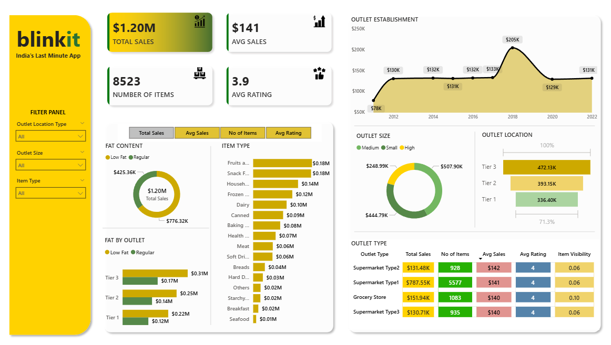

\# Blinkit Sales Analysis Dashboard

This Power BI dashboard analyzes Blinkit grocery sales data to uncover insights on sales performance, outlet distribution, and product categories.

\## Key Insights

\- Total Sales: $1.20M

\- Average Sales: $141

\- Number of Items: 8523

\- Average Rating: 3.9

\## Dashboard Features

\- Sales trend by outlet establishment year

\- Sales distribution by outlet size

\- Sales comparison by outlet location

\- Product category sales analysis

\- Filter panel for outlet location, size, and item type

\## Tools \& Technologies

\- Microsoft Excel (Data Cleaning \& Preparation)

\- Power BI (Dashboard Creation \& Visualization)

\- Data Analysis

\- Business Intelligence Reporting

## Project Screenshot

